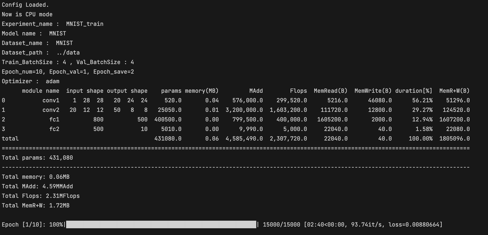

# Simple_DL_Arch_pytorch

---

 Build own DL framework for quick experiments.

---

## visualization



---

## Support

| Model                   |
| ----------------------- |
| MNIST                   |
| CIFAR10                 |
| Super-Resolution (TODO) |
| Mvtec (TODO)            |

---

## Start

```python
python main.py --config ./options/MNIST.yaml
#python main.py --config ./options/CIFAR10.yaml
```

---

## How to customize

### Step1

Modify your own ****.yaml .

### Step2

Add your custom dataloader in **dataloader.py**.

### Step3

Add your model arch in models.

### Step4

Modify **units.py** "get_model" and "get_optimizer" function.

### Step5

Modify **loss.py** "get_loss" function.

### Step6

Modify **test.py** calculate accuracy method for different task.
